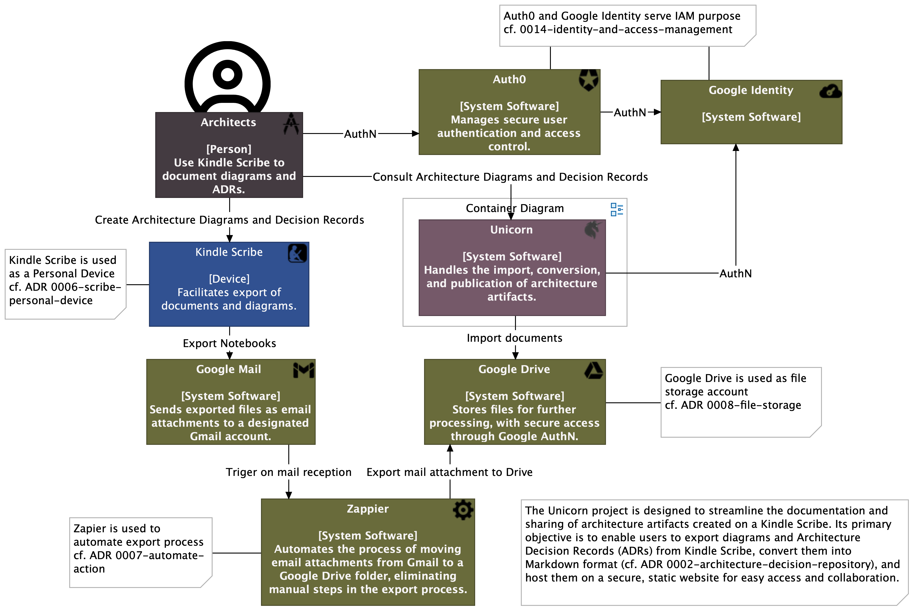
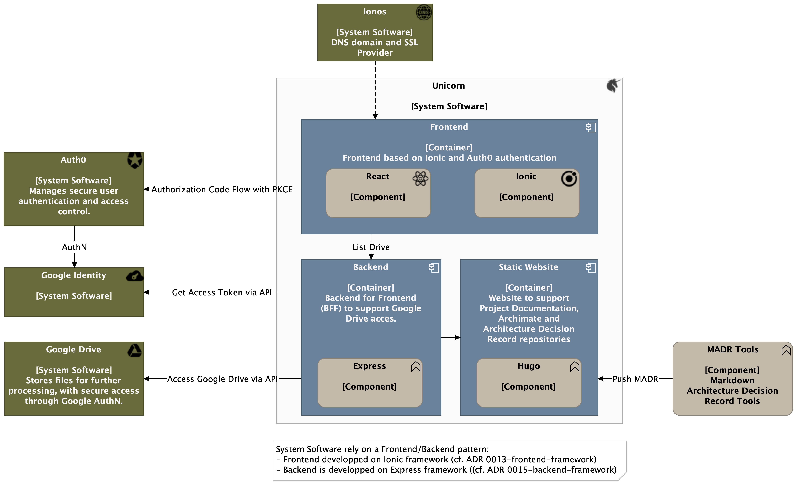

# unicorn-ionic
SPA based on Ionic for Unicorn project.
## Context
The Unicorn project is designed to streamline the documentation and sharing of architecture artifacts created on a Kindle Scribe. Its primary objective is to enable users to export diagrams and Architecture Decision Records (ADRs) from Kindle Scribe, convert them into Markdown format, and host them on a secure, static website for easy access and collaboration.



## System Software Overview
System Software rely on a Frontend/Backend pattern: 
- Frontend developped on Ionic framework (cf. ADR 0013-frontend-framework)
- Backend developped on Express framework (cf. ADR 0015-backend-framework)



## Start Ionic Server
```
ionic serve
```